### **Implementing Machine Leaning and MLOps for Targeted custmer marketing with Azure Machine Learning**

#### **Introduction**
Contoso Bank is undergoing a comprehensive digital transformation across all its departments to enhance their operational efficiency and customer engagement. Currently, the bank's customer base is predominantly composed of liability customers (depositors), while the asset customer base (borrowers) is relatively smaller. The bank aims to rapidly expand its asset customer segment to generate additional revenue through loan interests.

In the previous quarter, the bank launched a marketing campaign targeting potential borrowers, which resulted in an average conversion rate in the single digits. As part of its digital transformation strategy, the marketing department seeks to design more effective campaigns that leverage targeted marketing techniques. The goal is to significantly increase the conversion ratio to double digits while maintaining the same budget as the last campaign. This initiative is pivotal for driving growth and maximizing the bank's profitability through increased borrowing activity.

**Workshop Objective**

As part of a POC, Contoso Bank's marketing team would like to work with the Data Analytics and AI engineering teams who can help them build an app that uses data-driven AI-enhanced strategies to improve campaign targeting, so the marketing team can aim for a double-digit conversion rate of the asset customer base within the same budget.
In this lab, you will work on behalf of Contoso Bank's AI engineering team to build a sample app, which makes use of Azure AI, AML and MLOps to achieve the solution.

**Tools and Technologies used in this workshop :**

1.  **Azure Machine Learning (AML)**: For building, training, and
    deploying the predictive model in the banking scenario.

2.  **MLOps**: For covering model training, deployment, and automated model
    management.

3.  **Azure AI Studio**: Used to create, configure, and deploy the
    chatbot powered by Azure AI and integrated with the AML model.

4.  **Azure AI Search**: For enriching the chatbot with search and query
    capabilities based on customer data and loan details.

5.  **Azure App Service**: To host and manage the deployed web
    application (chat app).

6.  **Azure Blob Storage**: For storing and managing datasets used in
    training and prediction.

7.  **Python SDK**: For interacting with Azure services, building the
    model and working with data pipelines.

### Lab 01: Setting up Azure Machine Learning Workspace
#### **Introduction:**
In this exercise, we will set up the foundational components of the Azure Machine Learning workspace. This workspace will be the environment where we train, deploy, and manage machine learning models. The tasks involves creating a new Azure Machine Learning resource, configuring the necessary compute resources, and ensuring that all security and access controls are in place. This environment will serve as the backbone for building predictive models and integrating MLOps into Contoso Bank’s marketing strategies. We are also assigning required permissions to the subscription to perform the above tasks and uploading loan guide documents for chatapp to use and respond to customer queries

**By the end of this lab you will know how-to:**

- Setup Azure Machine Learning workspace

### **Task 1: Setting up Azure Machine Learning Workspace** 

#### **Introduction:**
>In this task, we will setup AML workspace for building, training, and deploying the predictive model in the banking scenario.

1. In the Edge browser, navigate to Azure Portal at
`https://portal.azure.com` and Sign In using your Azure user credentials (provided in the Resources section).

2. Click on Cloud shell and select **Bash**.

    

3. Select **No storage account** **required** radio button , select **your Azure subscription** and then click on **Apply**.

    

4. Run below command to clone the project solution. +++git clone https://github.com/technofocus-pte/MLOps-Driven-Chatbot-with-Azure-AI-AML-and-Azure-AI-Search-Integration.git+++

    

5. Install Python dependencies (like azureml-sdk):Run below commands +++pip install azureml-sdk+++

    

6. Run below script to create resources in Azure.

    +++cd MLOps-Driven-Chatbot-with-Azure-AI-AML-and-Azure-AI-Search-Integration/scripts/+++

    +++chmod +x setup.sh+++

    +++./setup.sh+++

    

7. Wait for the script to complete. It takes 4-5 minutes for the script to run.

    

    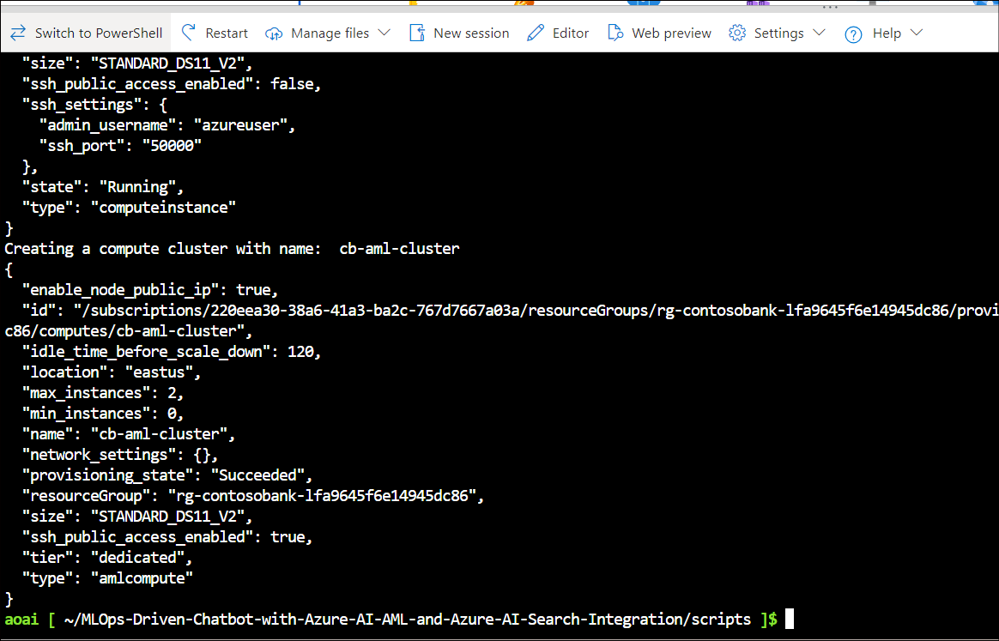

8. Close the **Cloud shell** and click on **Resource Group** tile.

    

9. Click on your resource group name.

    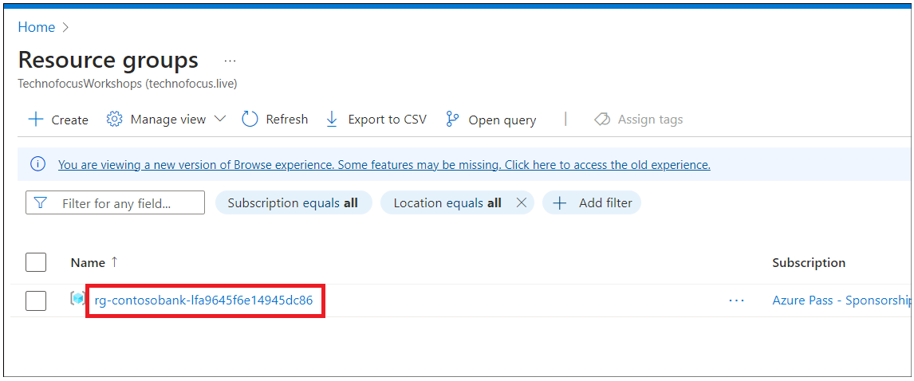

10. Go through the list of the resources to ensure all the resources are created.

    

11. Click on **Azure Machine Learning workspace** name.

    

12. Click on **Access control (IAM)** from left navigation menu, click
    on **Add -> Add role assignment.**

    

13. Select **Privileged administrator roles -> Contributor** role and
    then click **Next.**

    

14. Select **user,group or service principal** radio button, click on
    **Select members** link. Search for your Azure subscription tenant
    ,select it and then click on **Select**.

    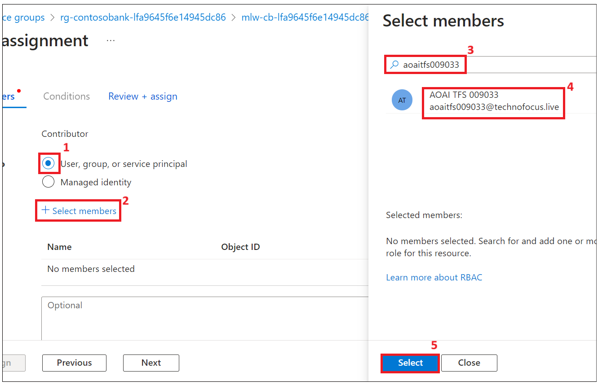

15. Click on **Review +assign**.

    

16. Again,click on **Review + assign**.

    

17. Click on **Overview** from left navigation and then click on
    **Launch studio** button.

    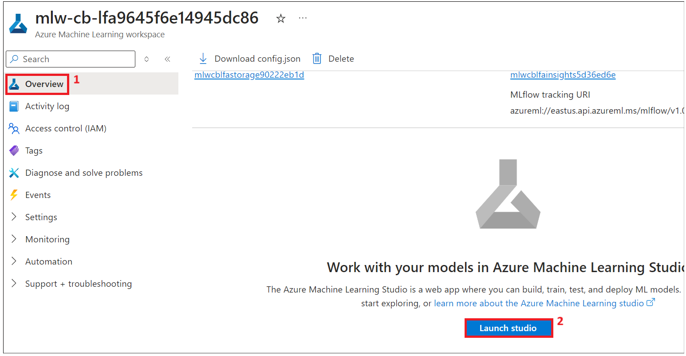

18. AML studio opens in new tab. Sign in with your Azure subscription
    account.

    

19. Click on Compute in the Manage section, from the left navigation menu. Note that the AML compute you created is listed and the State is **Running**.

    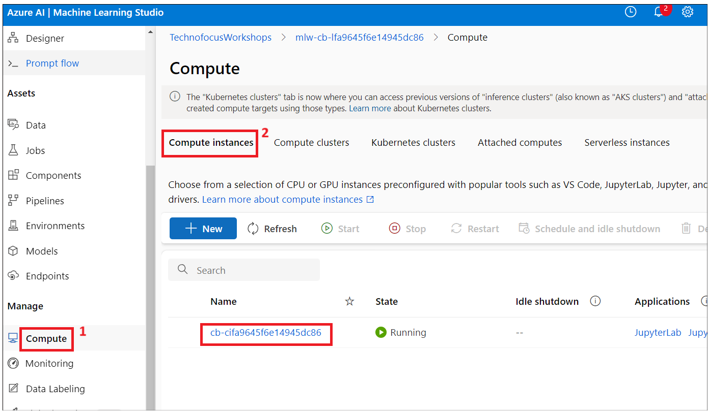

20. Click on **Compute clusters** , cluster should have created
    successfully.

    
>#### **Summary:** In this task, we successfully created an Azure Machine Learning workspace and configured compute resources, which will be used for training and deploying machine learning models. These foundational steps ensure that we have a secure, scalable environment in place to support the bank's data science and marketing initiatives.

### **Task 2 : Assign roles to the subscription**

> We need to assign sufficient roles and permissions to your user account on the created resource group in order to be able to index and enrich the customer data, and to be able to create OpenAI services in the workspace.

1. Switch back to **Azure portal** home page and click on **Resource group** tile.

    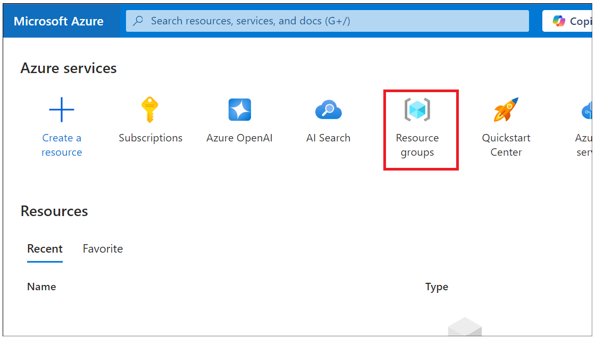

2. Click on your resource group name.

    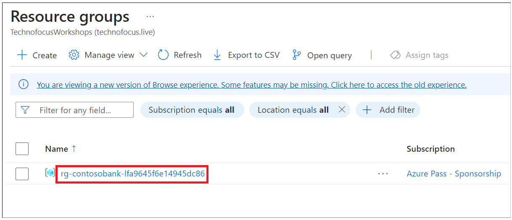

3. Click on **Access control(IAM)** from left navigation menu, select **Add - > Add role assignment.**

    

4. Search for `AzureML Compute Operator` and select it. Click on
    **Next** .

    

5. Select **users, group or service principal** radio button, click on **select members** hyper link. Search for your **aoaitfsXXXX**
    (relace XXXX with your tenant number) id and select it. Finally, click on **Select** button

    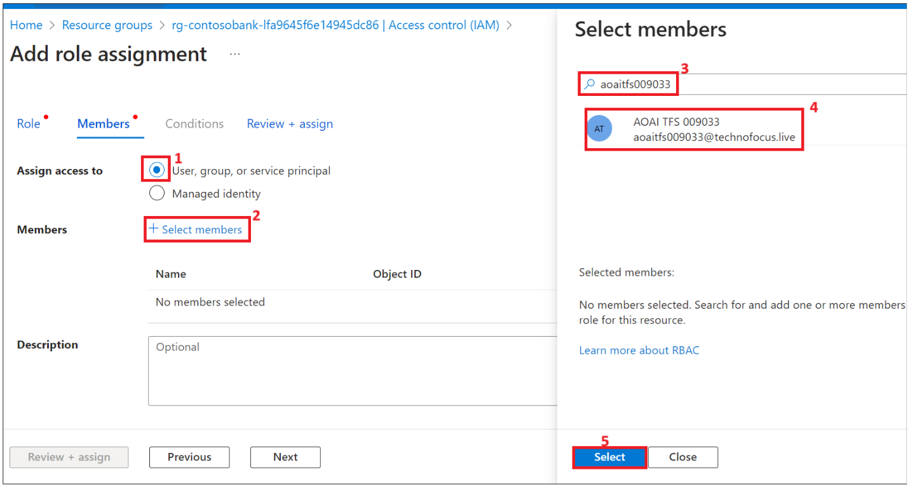

6. Click on **Next**.

    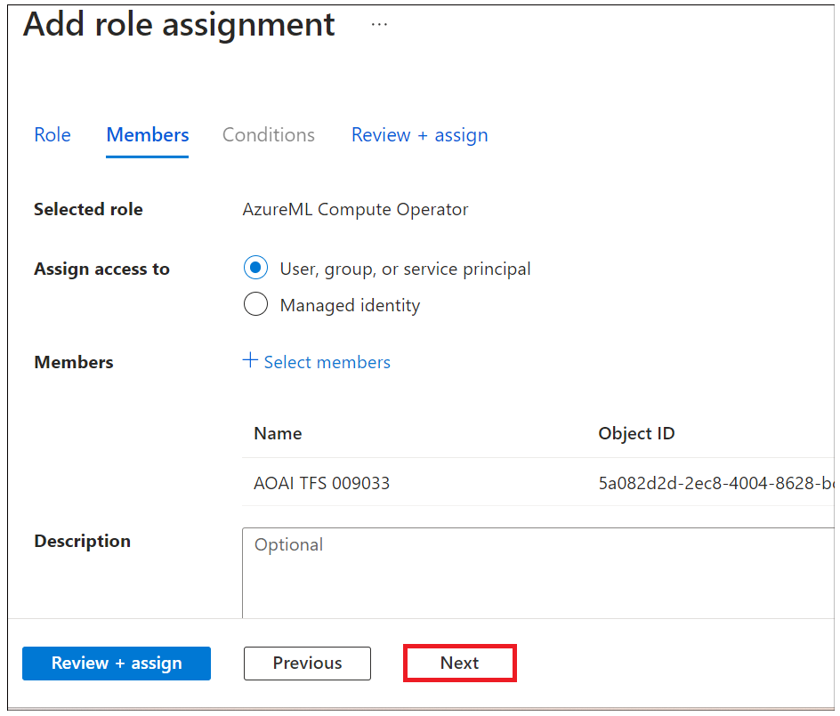

7. Click on **Review + assign** now.

    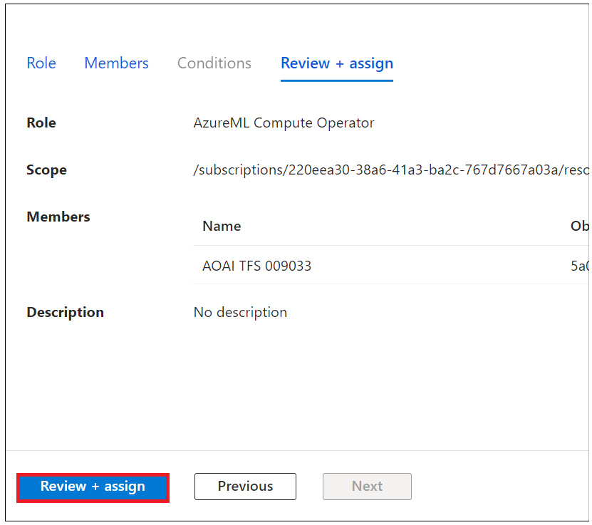

8.  After role assignments are successful, click on **Add -> Add role
    assignment**.

    

9.  Search for the below roles and assign them. Repeat above steps for below
    roles as well

    `Search Index Data Reader`

    `Cognitive Services Contributor`

    `Cognitive Services OpenAI User`

    `Search Service Contributor`

    `Azure AI Developer`

    

    

    

    

    

21. Click on **Role assignments.**

    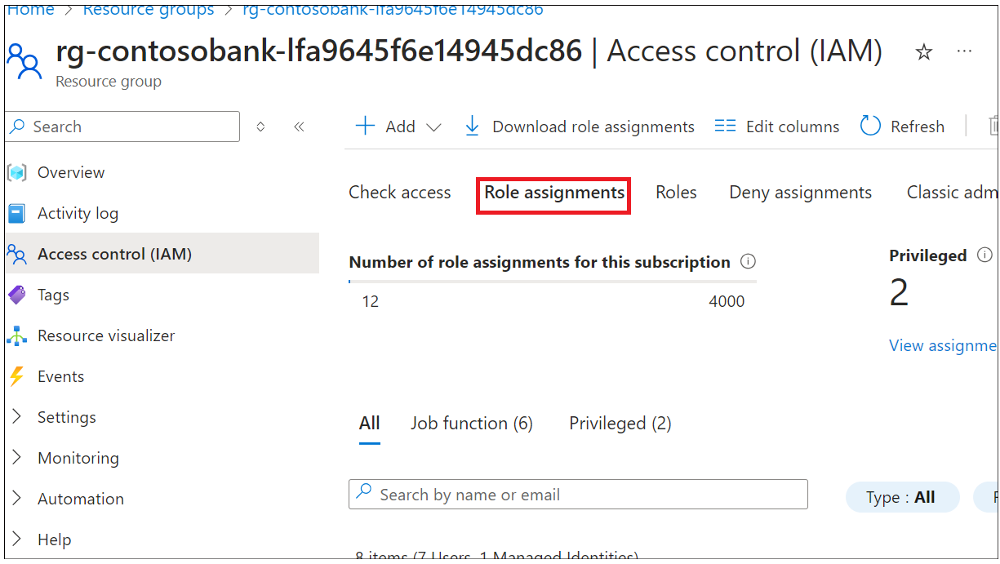

22. You should be able to see all the assigned roles to your tenant.

    

### **Task 3 : Upload Contoso Bank loan documents into Azure Storage account**

 When you create an Azure Machine Learning workspace, a Storage Account
is automatically created and connected to your workspace.Upload Contoso Bank loan documents and access them to answer customer queries in Chatapp

1.  In **Azure portal- > Resource group** , click on Storage account name

    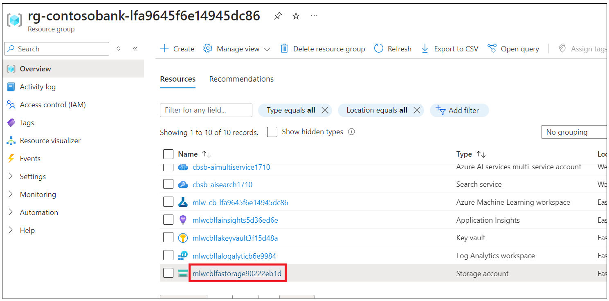

2.  Select **Configuration** under **Settings**. Then set **Allow Blob anonymous access** to **Enabled** and then click **Save**.

    

3.  Click on **Containers** under **Data storage** and click **azureml-blobstore-XXXXXXXXXXXXX** container.

    

4.  Click on **Upload -> Browse for files** . select the files from **C:\Labfiles\resources** folder and then click on **Open**.

    

5.  Click on **Upload**

    

    

>#### **Summary:** By the end of this exercise, we successfully created an Azure Machine Learning workspace and configured compute resources, which will be used for training and deploying machine learning models with required permissions to perform tasks. These foundational steps ensure that we have a secure, scalable environment in place to support the bank's data science and marketing initiatives.

