### **Setting up Azure Machine Learning Workspace**

**At the end of this lab you will know how-to:**

- Build and register a Machine learning model using Azure machine Learning Studio

#### **Introduction:**
In this lab, we will set up the foundational components of the Azure Machine Learning workspace. This workspace will be the environment where we train, deploy, and manage machine learning models. The tasks involves creating a new Azure Machine Learning resource, configuring the necessary compute resources, and ensuring that all security and access controls are in place. This environment will serve as the backbone for building predictive models and integrating MLOps into Contoso Bank’s marketing strategies. We are also assigning required permissions to the subscription to perform the above tasks and uploading loan guide documents for chatapp to use and respond to customer queries

### **Task 1 : Register Datasets**

 In this task, we will now register the datasets containing customer data with AML, so we can train the model based on this data. 

1.  Switch back to AML studio tab ( open new tab -> Azure Portal-> Resource group -> AML resource -> Launch Azure Machine learn
    studio), Under **Asset** , click on **Data** from left navigation menu and then click on **Data assets-> Create.**

    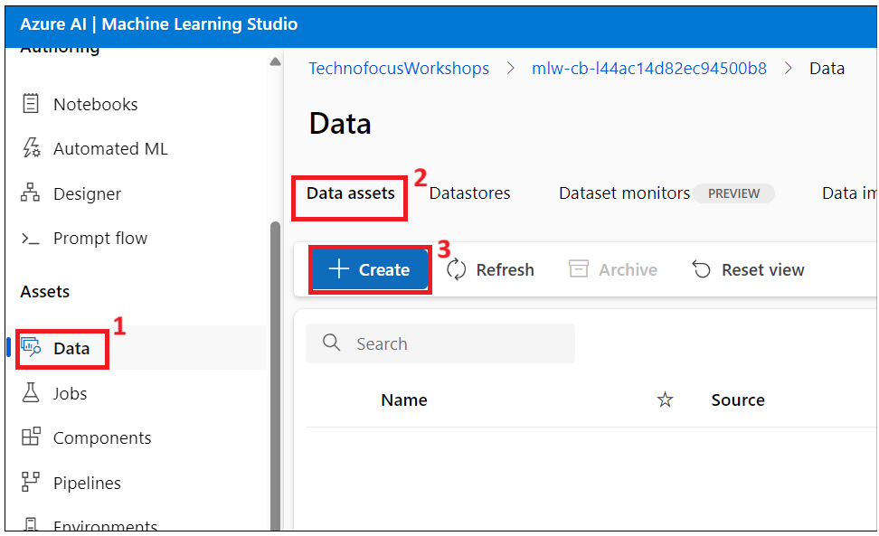

2.  Enter the name as : `Dataset1` and select Type : **Tabular** and then click on **Next**.

    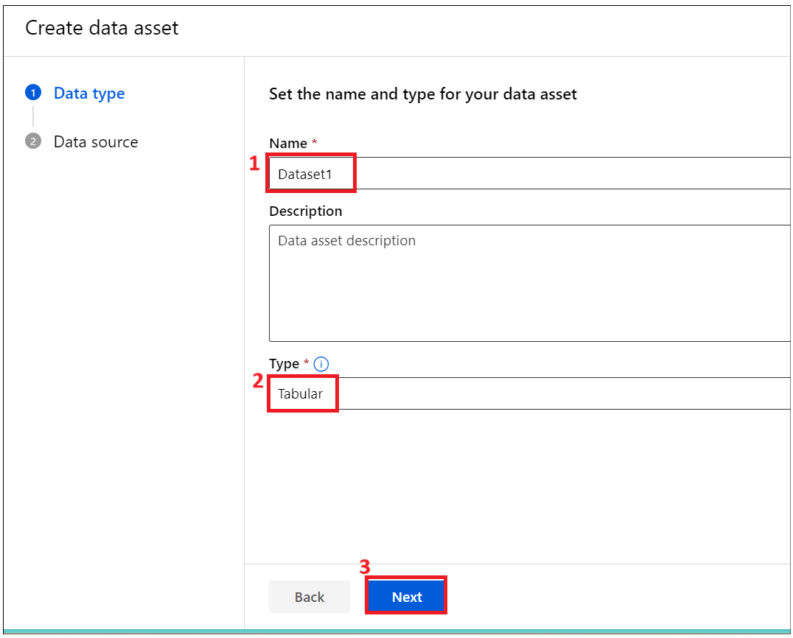

3.  On this page, notice that there are several options to choose a source for your dataset including, Azure storage, SQL databases, web files, local files and event Azure Open Datasets. We will choose the Local files as our source in this lab. Select From local files and then click **Next**

    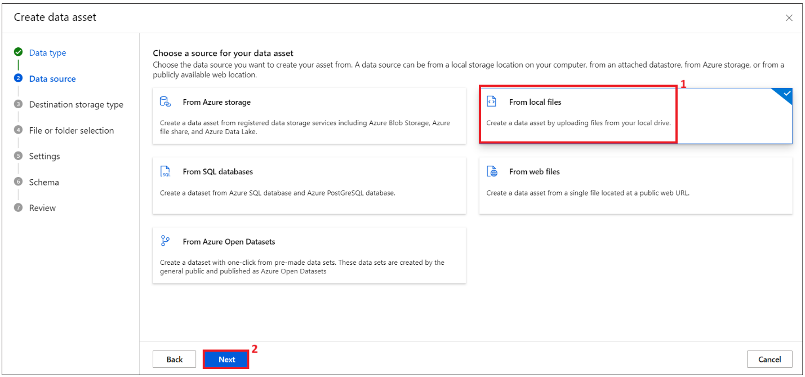

4.  On this page, you can see two Datastore types.You can create new datastore from this page .We are selecting Datastore type **as Azure Blob storage** for our lab and select the default blob storage( you can check in Data-\> Datastore) and click
    on **Next**.

    

5.  On this page, you have options to upload files or folder but we choose files to upload for this lab.Click on **Upload files or folder** drop down and select **Upload files.**

    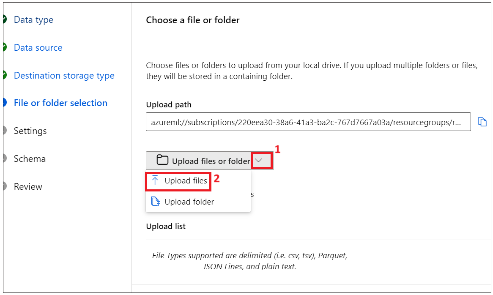

6.  Browse to **C:\Labfiles\Data** folder and select **Dataset1.CSV** and
    then click on **Open**.

    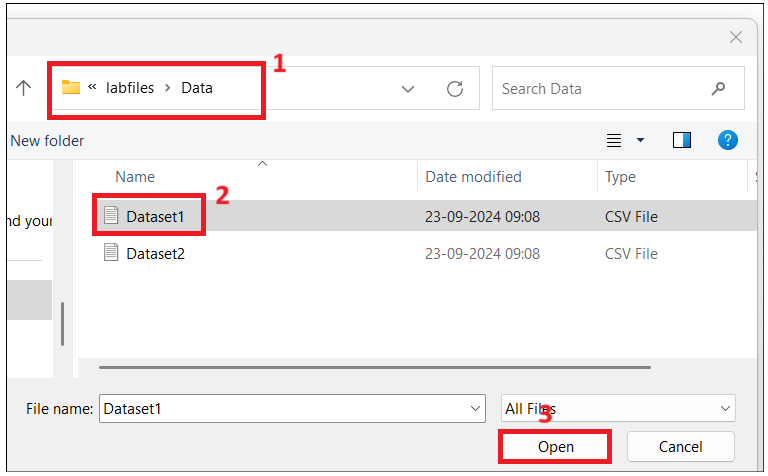

7.  Click **Next** now.

    

8.  Review the dataset that was imported from the CSV you uploaded in the last step. Then click Next.

    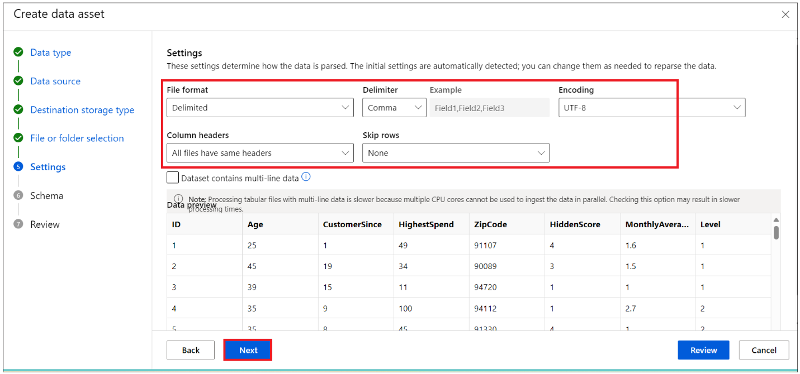

9.  Click **Next** now.

    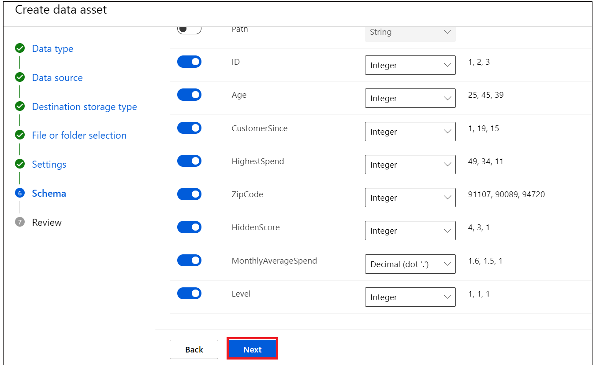

10. Review the details and then click on **Create**.

    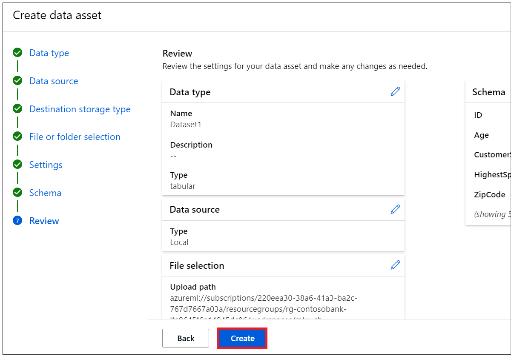

    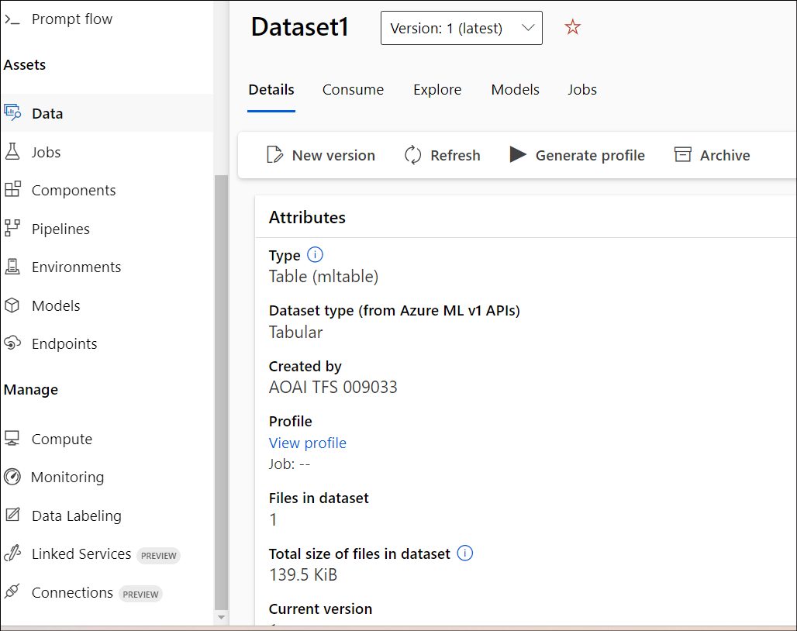

11. Repeat the above steps and register Dataset2.CSV with the name `Dataset2` also.

    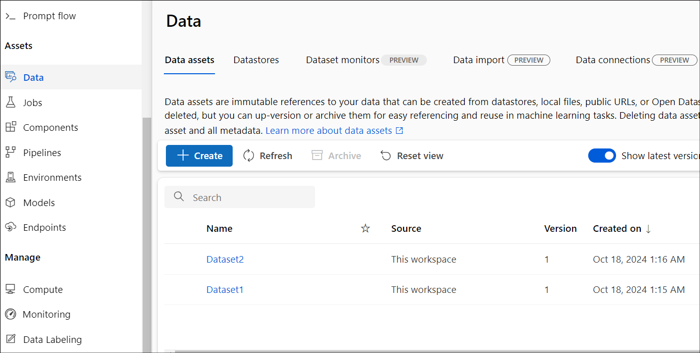

### **Task 2 : Access Notebook to train a model with the AML studio**

In this task,we learn how to access the python SDK notebook from AML

1.  'On AML Studio home page,click on **Compute -> Computer instance.** Select **Compute instance** name and then click under **Application** and select
    **Terminal.**

    

2.  Close the pop up window.

    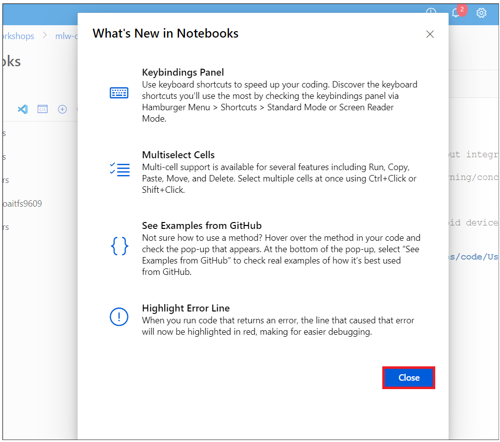

3. In the terminal, install the Python SDK on the compute instance by running the following commands in the terminal:

    `pip install azure-ai-ml`

    >Note : Ignore any (error) messages that say that the packages couldn't be found and uninstalled.

    

4. Run the following command to clone a Git repository containing a notebook, data, and other files to your workspace:

    `git clone https://github.com/technofocus-pte/MLOps-Driven-Chatbot-with-Azure-AI-AML-and-Azure-AI-Search-Integration.git`

    

5. When the command has completed, in the **Files** pane, click **↻** to refresh the view and verify that a
    new **Users/*your-user-name*/MLops…** folder has been created.

    

6. Stay back in the same page to continue.

