### **Lab 03 - Setting up MLOps for model training and deployment using Python SDK**

**In this lab you will learn how-to:**

- Train a model and deploy it in AML using Python SDK

# Setting up MLOps for model training and deployment using Python SDK

>**Introduction:** :In this exercise, we will focus on implementing a streamlined approach to model deployment by utilizing a Python SDK notebook for model training and deployment, rather than automated MLOps pipelines. This hands-on approach allows us to register datasets, build, and deploy predictive models directly through the Azure Machine Learning environment without requiring Azure DevOps pipelines. This setup will enable Contoso Bank to initiate targeted marketing efforts using up-to-date borrower behavior models, which can further be updated manually as needed.

### **Task 1 : Run the notebook to Work with Data**

In this task,we will use python SDK to clean the data and train the model using the data

1.  While still in Azure ML Studio, Terminal for your deployed compute instance, expand **models** folder (created as a result of the previous exercise), and select the **ContosoBankAMLmodel.ipynb** notebook.

    

2.  Run the cell in **Before we start** section to check the latest version of azure-ai-ml package.

    > Note: If the azure-ai-ml package is not installed, run **pip install azure-ai-ml** to install it

    

    > Note : Select **Authenticate** and follow the necessary steps if a notification appears asking you to authenticate.

3.  Verify that the notebook uses the **Python 3.8 - AzureML** kernel.If its not using then select it from drop down.

    

4.  Restart the kernel as shown in below image.

    

5.  Click on **Restart**.

    

6.  Read description of each cell under **connect to Workspace** section and run it

    

7.  Run cell to **list the datastores** in storage account.

    

8.  Run the cell to **clean , merge datasets and save** into **merge_data.CSV** file.

    

    

9. Run cell to preview **merge_data.csv** file. Then run all the remaining cells in this section.

    

    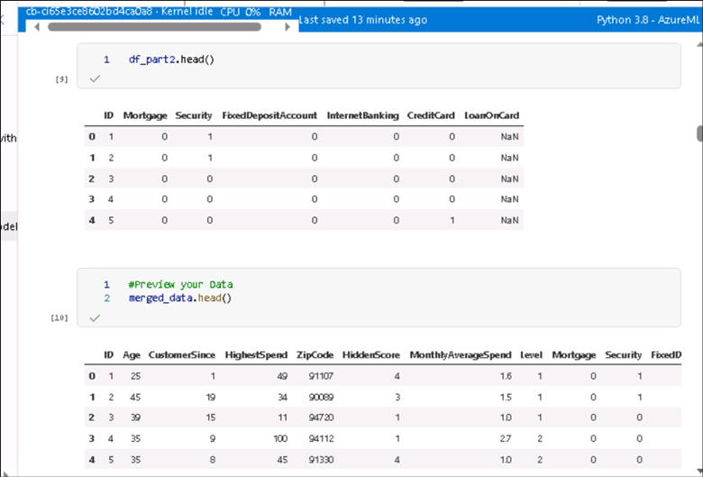

10.  Run cell to Describe the data after transposing

        

11. Run the cell to replace missing value with 0.

    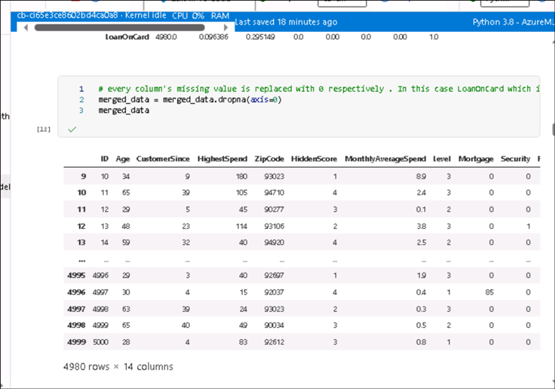

12. Run the cell to check non-numeric values in the dataframe.

    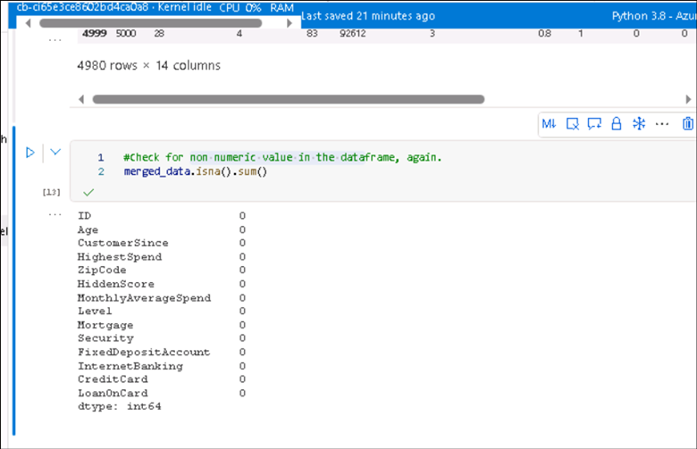

13. Run the cell to drop column not required for training the model.

    

14. Run all the cells and check merged_data to check number of rows.

    

15. Run cell to show unique values in the LoadOnCard Column.

    

16. Run cell to show distribution of data in InternetBanking column

    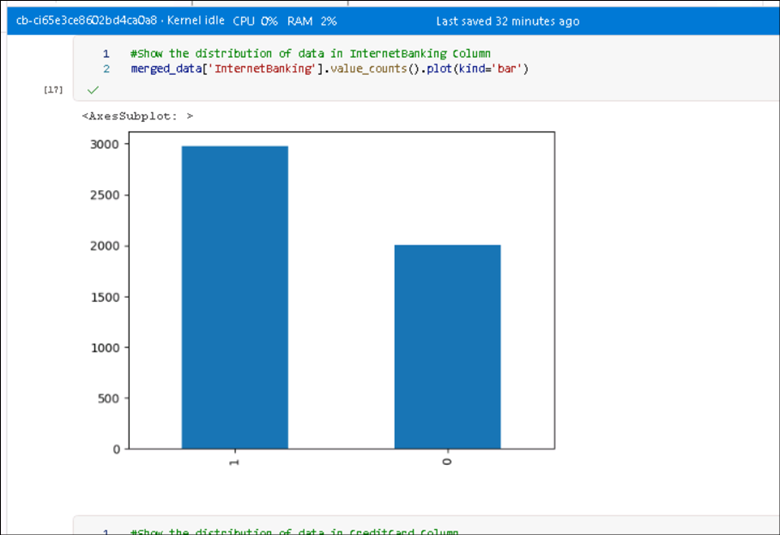
    

17. Run cell to show distribution of data in CreditCard column

    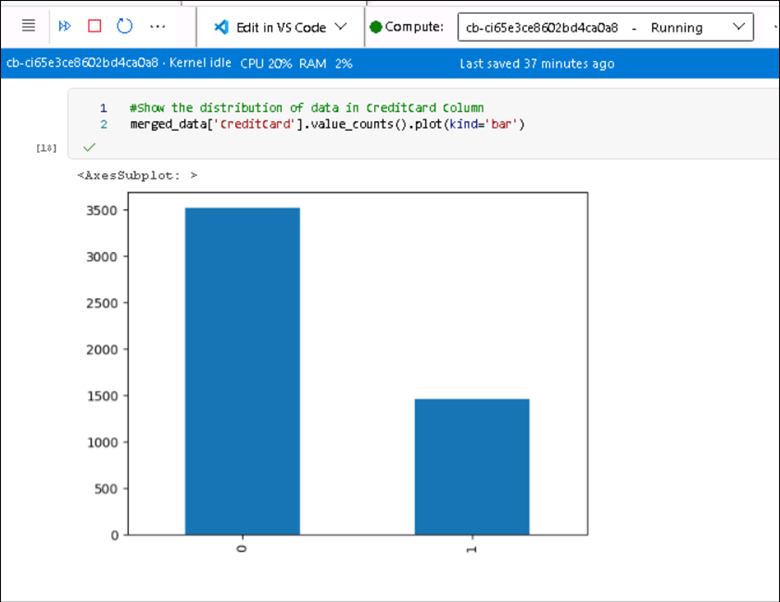

18. Run cell to show distribution of data in LoanonCard column

    

19. Run cell to show distribution of data in FixedDepositAccount column

    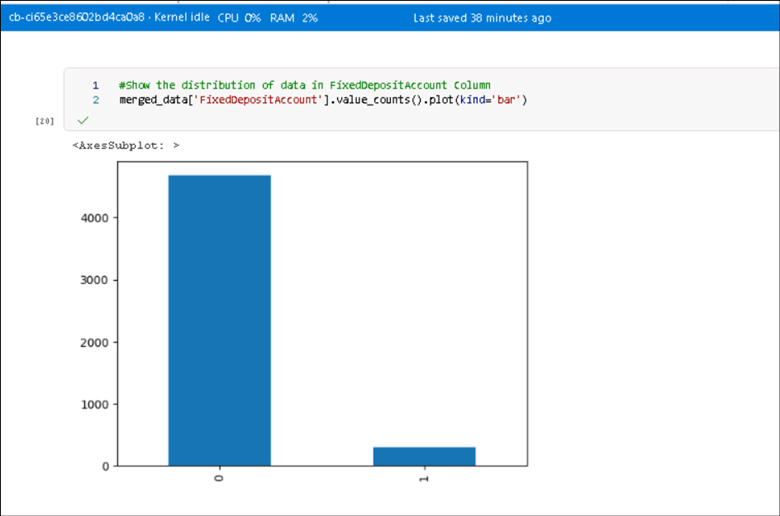

20. Run cell to show distribution of data in data in security column

    

21. Run the cell to display all columns with columns missing values replaced with 0

    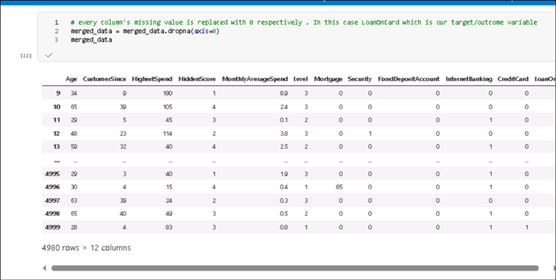

22. Run cell to check non numeric values in the dataframe.

    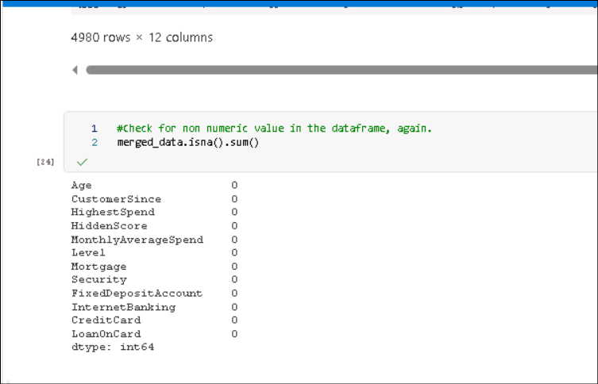

23. Run cell to explore, analyse and visualise data using univariate analysis 

    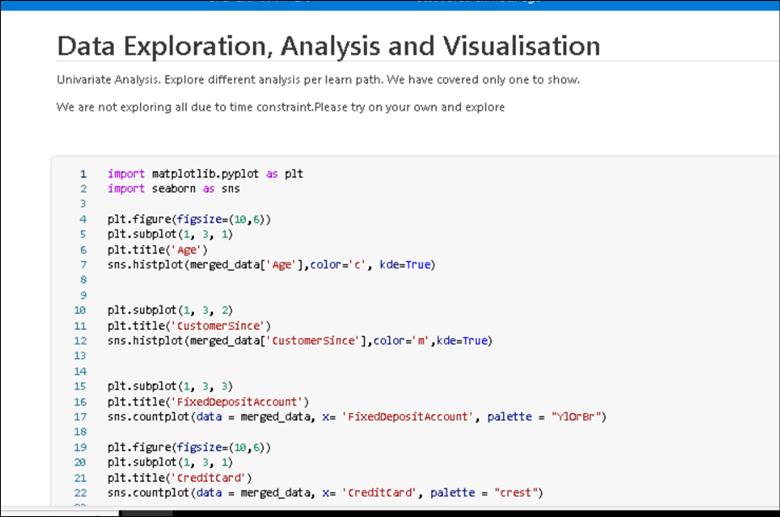

24. Run cell to process data for modeling.

    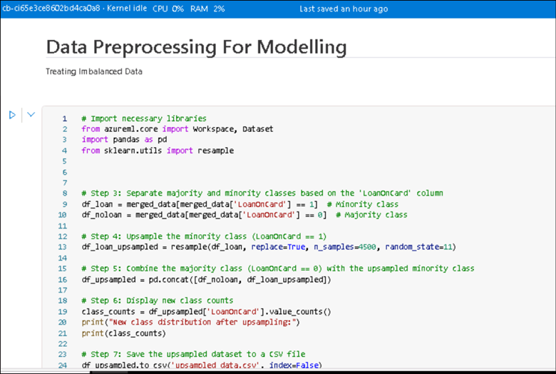

25. Run cell to upsampling data

    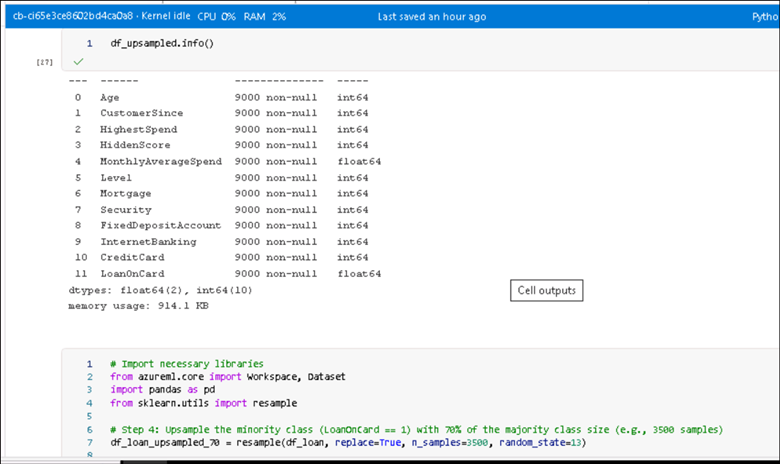

26. Read and run each cell under **Model Preparation** and explore.

    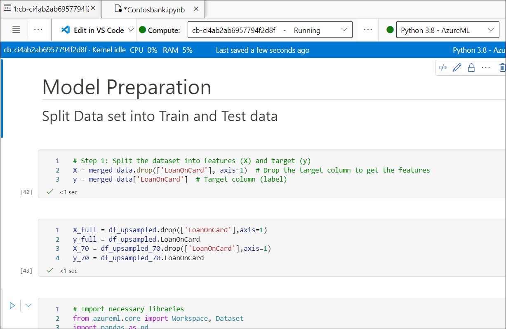

    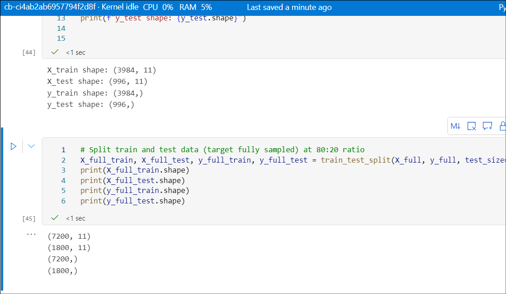

    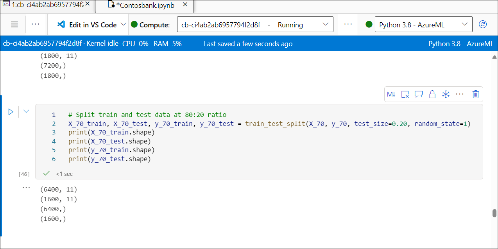

27. Read and run cell in **Apply Logistic Regression** section

    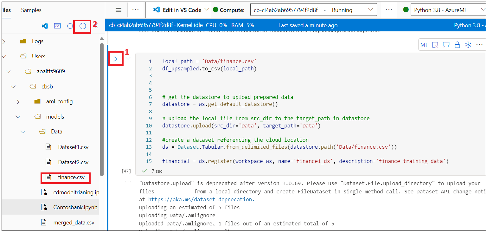

28. When we run a Python script as an experiment in Azure Machine Learning, a Conda environment is created to define the execution context for the script. Azure Machine Learning provides a default environment that includes many common packages; including the azureml-defaults package that contains the libraries necessary for working with an experiment run, as well as popular packages like pandas and numpy. Run cell in **Define an environment** section to define and register financial-experiment-env environment

    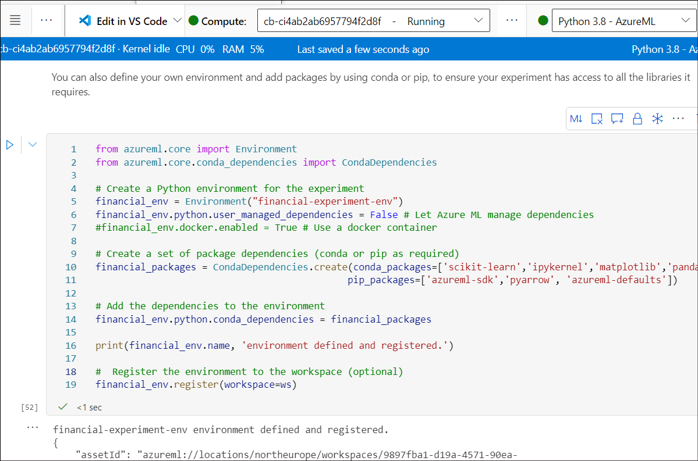

29. Next, run cell to **view registered environments**.

    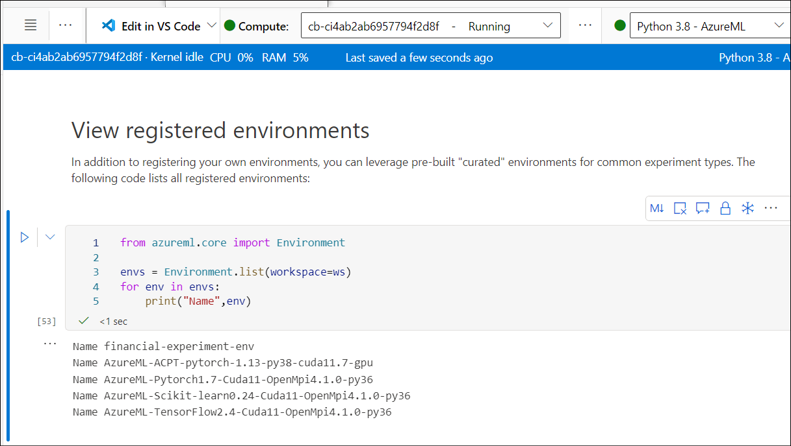

30. Run cell to create training script-finance_training.py

    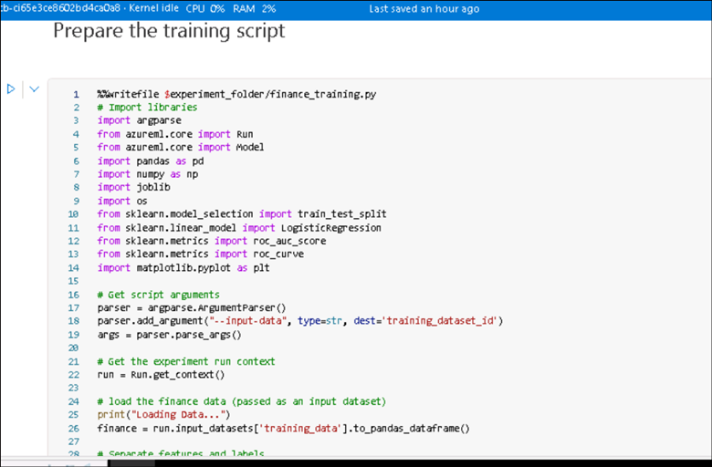

31. Run all cells to **run an experiment on remote compute**.

    

32. Run the experiment cell . wait for the experiment to complete . It
    takes **15-20 minutes.**. 

    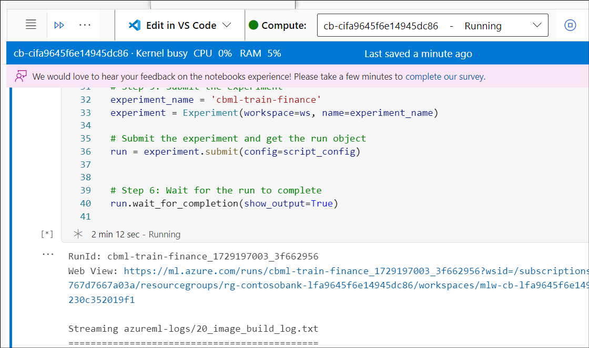

    

    

33. Run the cell to register the model that was trained by an experiment 

    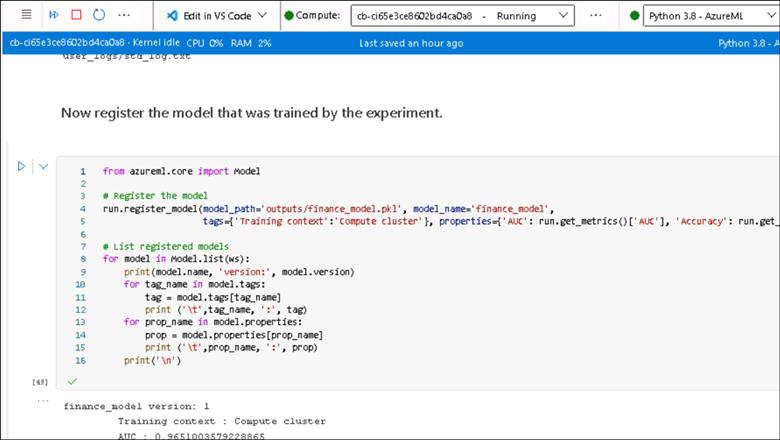

34. Run each cell under **Deploy the model as a web service** section.

    

35. Run the cell to provide web service endpoint under **Use the web service** section.

    

36. Run all cells to predict Asset and liability Customers.

    

>**Summary:** Using the Python SDK notebook, we have successfully trained and deployed predictive models for analyzing borrower behavior without relying on automated pipelines or DevOps. This approach allows Contoso Bank to manually update and deploy models as needed, enabling targeted marketing efforts with up-to-date insights into borrower behavior.
