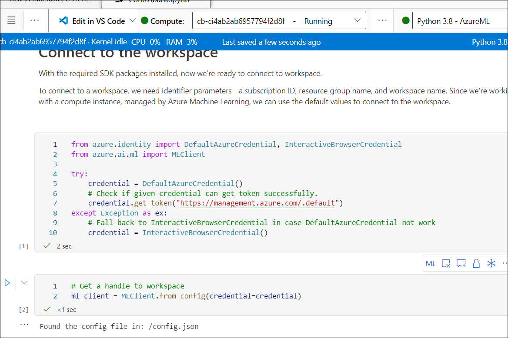
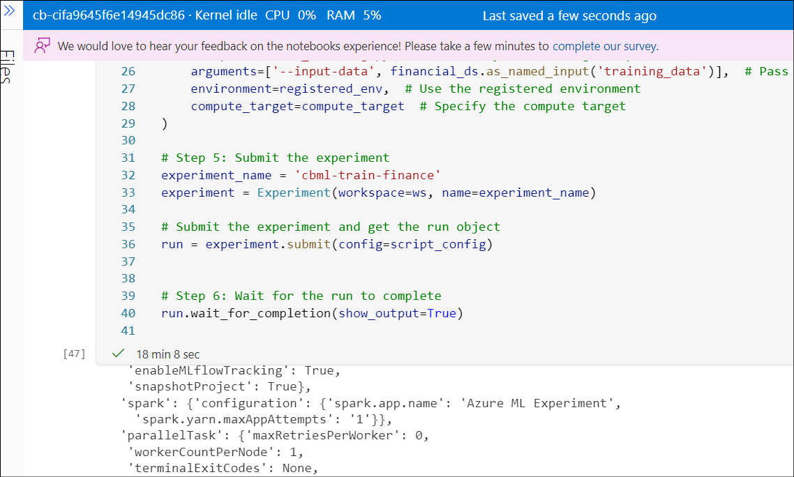
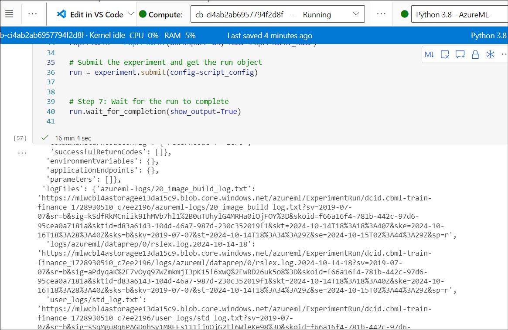
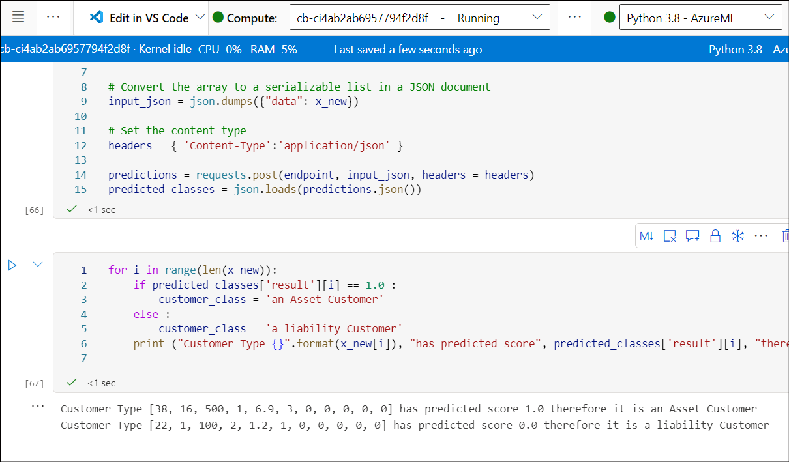

### **Leveraging MLOps and Azure OpenAI for Targeted Marketing: Contoso Bank's Journey to Expand Borrower Base**

**At the end of this lab you will know how-to:**

- train model and deploy in AML using Python SDK

# Setting up MLOps for model training and  deployment

>**Introduction:** :This exercise focuses on implementing MLOps pipelines that automate the end-to-end process of model deployment. We will create and configure pipelines within Azure DevOps, enabling the automation of model training, testing, and deployment. This will allow Contoso Bank to streamline the process of updating machine learning models, ensuring that marketing models are always using the most up-to-date data and techniques.

### **Task 1 : Run the notebook to Work with Data**

In this task,we use python SDK to clean the data and train the model using the data

1.  Expand **models** folder and select the **ContosoBankAMLmodel.ipynb** notebook.

2.  Run the first cell to check the latest version of azure-ai-ml package.

    > Note: If the azure-ai-ml package is not installed, run **pip install azure-ai-ml** to install it

    

    > Note : Select **Authenticate** and follow the necessary steps if a notification appears asking you to authenticate.

3.  Verify that the notebook uses the **Python 3.8 - AzureML** kernel.If its not using then select it from drop down.

    

4.  Restart the kernel as shown in below image.

    

5.  Click on **Restart**.

    

6.  Read description of each cell and run it

    

7.  Run cell to list datastores in storage account.

    

8.  Run the cell to clean , merge datasets and save into **merge_data.CSV** file.

    

    

9. Run cell to preview merge_data.csv file.Run all the cells

    

10.  Run cell to Describe the data after transposing

        

11. Run all the cells and check merged_data to check number of rows.

    

12. Run cell to show unique values in the LoadOnCard Column.

    

13. Run cell to show distribution of data in LoanonCard column

    

14. Read and run each cell under Model Preparation and explore.

    

    

    

15. Read and run cell in Apply Logistic Regression

    

16. Run cell to define and register financial-experiment-env environment

    

17. Run cell to view registered environments.

    

18. Run all cells to run an experiment.

    

19. Run the experiment cell . wait for the experiment to complete . It
    takes **15-20 minutes.**. 

    

    

    

20. Run each cell under deploy the model as a web service.

    

21. Run the cell to provide web service endpoint.

    

21. Run all cells to predict Asset and liability Customers.

    

>**Summary:** By implementing the MLOps pipelines, we have automated the process of model deployment and lifecycle management. This ensures that Contoso Bank’s predictive models are continuously updated and deployed with minimal manual intervention. The automation enables faster iteration cycles and supports the bank’s dynamic marketing needs.

