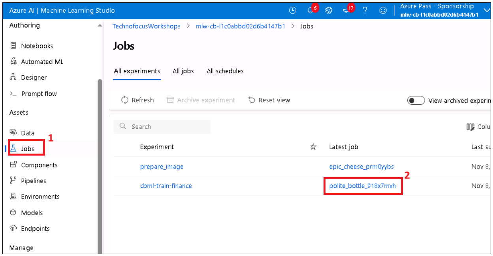
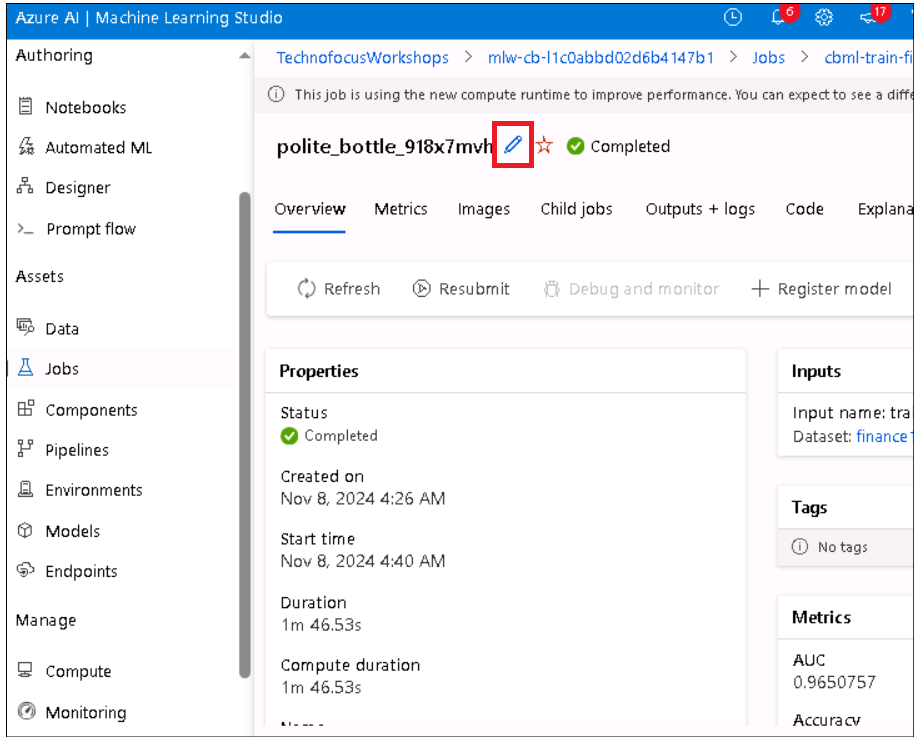
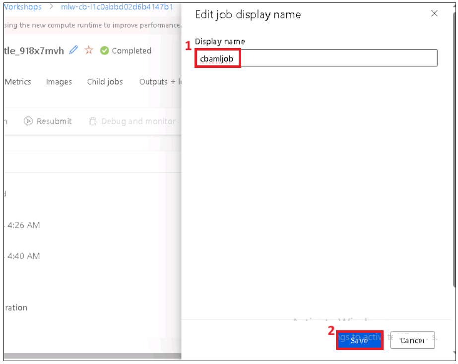
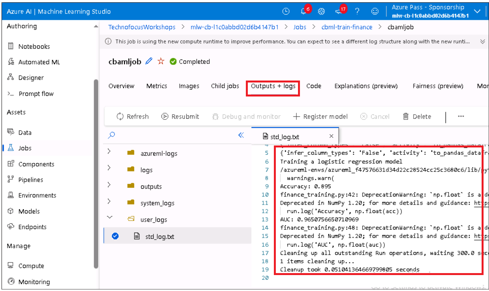
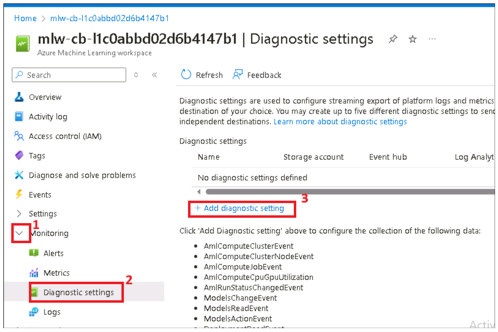
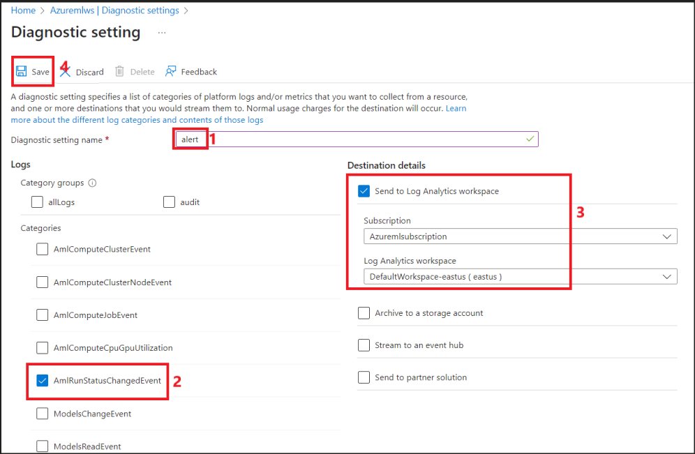
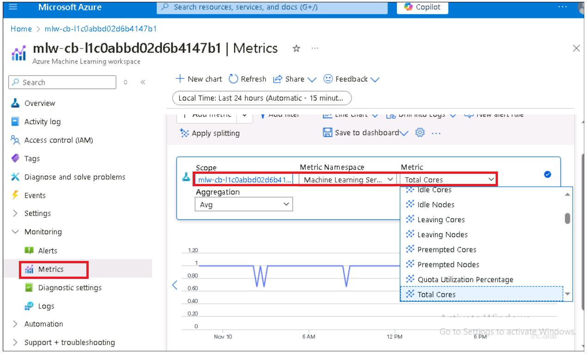
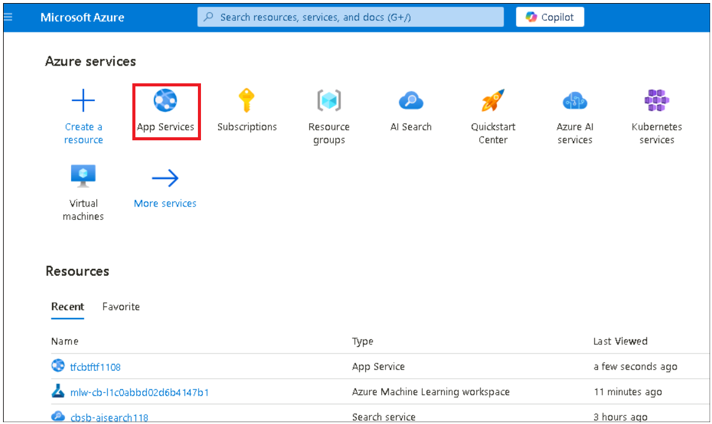
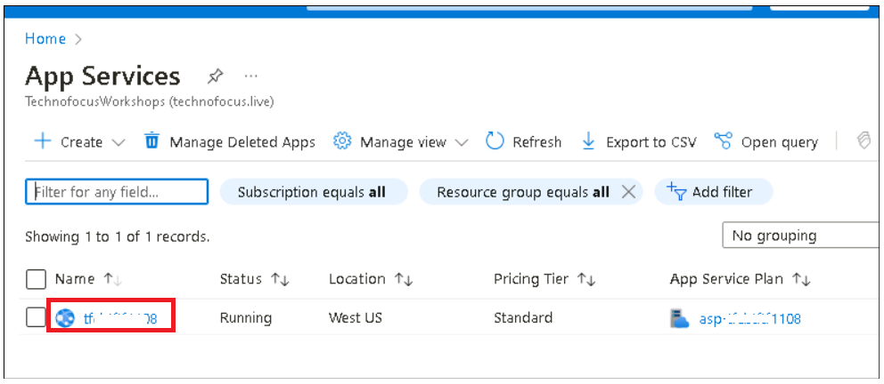
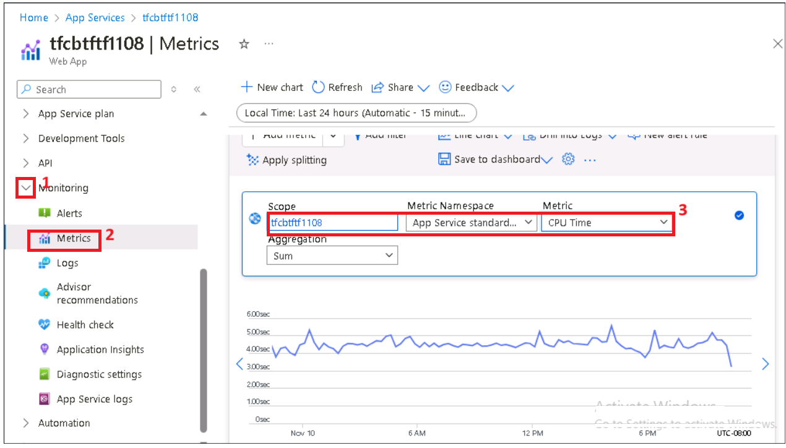

# **Lab 06_Continuous Monitoring and Model Management.**

# **Exercise 1 : Monitoring and analyzing jobs in studio**

Your ML job history is an important part of an explainable and
repeatable ML development process. You can use Azure Machine Learning
studio to monitor, organize, and track your jobs for training and
experimentation.

### **Task 1: Job display name**

1.  Switch back to AML studio tab, from the left pane, in the Azure ML
    Studio, click on **Jobs** and select the job next to your
    experiment.

The job display name is an optional and customizable name that you can
provide for your job. To edit the job display name:

2.  Select the **Edit** button to edit the job display name.

3.  Give ++**cbamljob**++ as the new name to the job and click on
    **Save** button.

### **Task 2: View job logs**

1.  Click on **Output + logs** option to view the job logs. It gives you
    both system and the user logs.

### **Task 3: Monitor the job status by email notification**

1.  Switch back to Azure Machine learning workspace (Azure portal ->
    Resource group- > AML workspace name)

2.  Expand **Monitoring** and select **Diagnostic settings** from the
    left pane. Click on **+ Add diagnostic setting.**

3.  Provide the Diagnostic setting name as ++**alert++**

- Under the **Category details**, select
  the **AmlRunStatusChangedEvent**.

- In the **Destination details**, select the **Send to Log Analytics
  workspace** and specify the **Subscription** and **Log Analytics
  workspace**(the default workspace)

- Scroll down and select **AllMetrics** checkbox under **Metrics**.

- Click on **Save**.

4.  You will receive a message stating **Successfully updated
    diagnostics**.

With this we have learnt on how to work/analyze the jobs, view and
monitor the logs.

### **Task 4: Monitor Metrics**

1.  Select Metrics under Monitoring from left navigation manu, select
    the metric you want to generate for your model . Explore with
    different types of metrics.

# **Exercise 2 : Monitoring Chat app**

1.  Switch back to your Azure portal home page, click on **App
    Services** tile.

2.  Click on your App name.

3.  Expand Monitoring and click on Metrics from left navigation menu,
    select Scope, Metric Namespace and required metric for your app to
    monitor.

> 

4.  Explore with different metrics
