### **Leveraging MLOps and Azure OpenAI for Targeted Marketing: Contoso Bank's Journey to Expand Borrower Base**

Contoso Bank is undergoing a comprehensive digital transformation across
all its departments to enhance its operational efficiency and customer
engagement. Currently, the bank's customer base is predominantly
composed of liability customers (depositors), while the asset customer
base (borrowers) is relatively smaller. The bank aims to rapidly expand
its asset customer segment to generate additional revenue through loan
interests.

In the previous quarter, the bank launched a marketing campaign
targeting potential borrowers, which resulted in an average conversion
rate in the single digits. As part of its digital transformation
strategy, the marketing department seeks to design more effective
campaigns that leverage targeted marketing techniques. The goal is to
significantly increase the conversion ratio to double digits while
maintaining the same budget as the last campaign. This initiative is
pivotal for driving growth and maximizing the bank's profitability
through increased borrowing activity.

**Tools/Technologies/Apps used :**

1.  **Azure Machine Learning (AML)**: For building, training, and
    deploying the predictive model in the banking scenario.

2.  **MLOps**: For applying DevOps practices in machine learning
    workflows, covering model training, deployment, and automated model
    management.

3.  **Azure AI Studio**: Used to create, configure, and deploy the
    chatbot powered by Azure AI and integrated with the AML model.

4.  **Azure AI Search**: For enriching the chatbot with search and query
    capabilities based on customer data and loan details.

5.  **Azure App Service**: To host and manage the deployed web
    application (chat app).

6.  **Azure Blob Storage**: For storing and managing datasets used in
    training and prediction.

7.  **Python SDK**: For interacting with Azure services, building the
    model, and working with data pipelines.

### **Task 1: Create Azure machine learning resources** 

1.  Open a browser and go to `https://portal.azure.com` and sign in with
    your Azure subscription.

2.  Click on Cloud shell and select **Bash**.

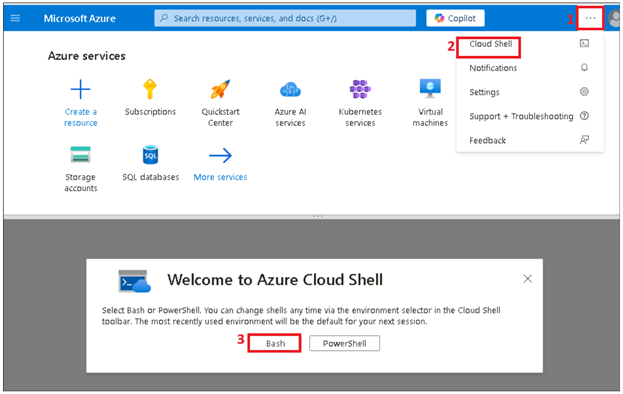

3.  Select **No storage account** **required** radio button , select
    **your Azure subscription** and then click on **Apply**.

4.  Run below command to close the project solution.

`git clone https://github.com/technofocus-pte/MLOps-Driven-Chatbot-with-Azure-AI-AML-and-Azure-AI-Search-Integration.git
`
> 

5.  Install Python dependencies (like azureml-sdk):Run below commands

`pip install azureml-sdk`

6.  Run below script to create resources in Azure.

`cd MLOps-Driven-Chatbot-with-Azure-AI-AML-and-Azure-AI-Search-Integration/scripts/`

`chmod +x setup.sh`

`./setup.sh`

7.  Wait for the script to run completely. It takes 4-5 minutes to
    complete.

8.  Close the **Cloud shell** and click on **Resource group** tile.

> 

9.  Click on resource group name.

10. Make sure all the resources are created.

11. Click on **Azure Machine Learning workspace** name.

12. Click on **Access control (IAM)** from left navigation menu, click
    on **Add -\> Add role assignment.**

13. Select **Privileged administrator roles -\> Contributor** role and
    then click **Next.**

> 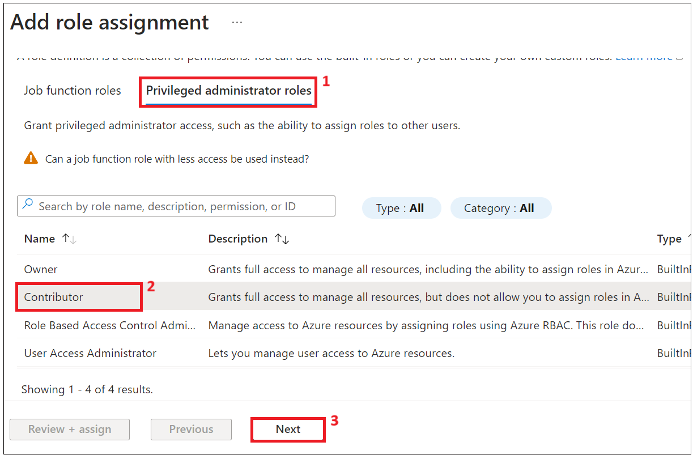

14. Select **user,group or service principal** radio button, click on
    **Select members** link. Search for your Azure subscription tenant
    ,select it and then click on **Select**.

> 

15. Click on **Review +assign**.

16. Again click on **Review + assign**.

> 

17. Click on **Overview** from left navigation and then click on
    **Launch studio** button.

18. AML studio opens in new tab. Sign in with your Azure subscription
    account.

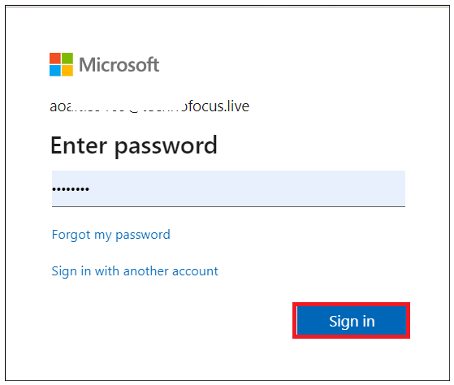

19. Click on **Compute** from left navigation menu and make sure compute
    instances and clusters are created and running status.

20. Click on **Compute** **cluster**s , cluster should have created
    successfully.

### Task 2 : Assing roles to the subscription

1.  Switch back to **Azure portal** home page and click on **Resource
    group** tile.

2.  Click on your resource group name.

3.  Click on **Access control(IAM)** from left navigation menu, select
    **Add - \> Add role assignment.**

4.  Search for `AzureML Compute Operator` and select it. Click on
    **Next** .

5.  Select **users, group or service principal** radio button, click on
    **select members** hyper link. Search for your **aoaitfsXXXX**
    (relace XXXX with your tenant number) id and select it. Finally,
    click on **Select** button

6.  Click on **Next**.

7.  Click on **Review + assign** now.

8.  After role assignment successful, click on **Add -\> Add role
    assignment**.

9.  Search for below roles and assign them. Repeat above steps for below
    roles as well

`Search Index Data Reader`

`Cognitive Services Contributor`

`Cognitive Services OpenAI User`

`Search Service Contributor`

`Azure AI Developer`

21. Click on **Role assignments.**

22. You should be able to see all the assigned roles to your tenant.

### Task 3 : Uploaded resource into Azure Storage account

> When you create an Azure Machine Learning workspace, a Storage Account
> is automatically created and connected to your workspace. You'll
> explore how the Storage Account is connected.

1.  In Azure portal- \> Resource group , click on Storage account name

2.  Select **Configuration** under **Settings**. Then set **Allow Blob
    anonymous access** to **Enabled** and then click **Save**.

3.  Click on **Containers** under **Data storage** and click
    **azureml-blobstore-XXXXXXXXXXXXX** container.

4.  Click on **Upload -\> Browse for files** . select the files from
    **C:\Labfiles\resources** folder and then click on **Open**.

5.  Click on **Upload**

### Task 4 : Register Datasets

1.  Switch back to AML studio tab ( open new tab -\> Azure Portal-\>
    Resource group -\> AML resource -\> Launch Azure Machine learn
    studio), Under **Asset** , click on **Data** from left navigation
    menu and then click on **Data asset-\> Create.**

> 

2.  Enter the name as : `Dataset1` and select Type : **Tabular** and
    then click on **Next**.

3.  Select **From local files tile** and then click on **Next**.

4.  Select Datastore type **as Azure Blob storage** and select the
    default blob storage( you can check in Data-\> Datastore) and click
    on **Next**.

> 

5.  Click on **Upload files or folder** drop down and select **Upload
    files.**

6.  Browse to `C:\Labfiles\Data` folder and select **Dataset1** and
    then click on **Open**.

7.  Click **Next** now.

8.  Review the data and change If you want to then click on **Next**.

9.  Click **Next** now.

10. Review the details and then click on **Create**.

11. Repeat above steps and register Dataset2.CSV with the name
    `Dataset2` also.

### Task 5 : Access Notebook to train a model with the Azure Machine 

1.  Click on **Compute -\> Computer instance.** Select **Compute
    instance** name and then click under **Application** and select
    **Terminal.**

2.  Close the pop up window.

12. In the terminal, install the Python SDK on the compute instance by
    running the following commands in the terminal:

`pip install azure-ai-ml`

>Note : Ignore any (error) messages that say that the packages couldn't
>be found and uninstalled.

13. Run the following command to clone a Git repository containing a
    notebook, data, and other files to your workspace:

`git clone https://github.com/technofocus-pte/MLOps-Driven-Chatbot-with-Azure-AI-AML-and-Azure-AI-Search-Integration.git`

14. When the command has completed, in the **Files** pane,
    click **↻** to refresh the view and verify that a
    new **Users/*your-user-name*/MLops…** folder has been created.

> 

15. Stay back in the same page to continue.

### Task 6 : Run the notebook to Work with Data

1.  Expand **models** folder and select the
    **ContosoBankAMLmodel.ipynb** notebook.

2.  Run the first cell to check the latest version of azure-ai-ml
    package.

> Note: If the azure-ai-ml package is not installed, run **pip install
> azure-ai-ml** to install it

> Select **Authenticate** and follow the necessary steps if a
> notification appears asking you to authenticate.

3.  Verify that the notebook uses the **Python 3.8 - AzureML** kernel.If
    its not using then select it from drop down.

4.  Restart the kernel as shown in below image.

5.  Click on **Restart**.

6.  Read description of each cell and run it

7.  Run cell to list datastores in storage account.

8.  Run the cell to clean , merge datasets and save into
    **merge_data.CSV** file.

8.Run cell to preview merge_data.csv file.Run all the cells

9.  Run cell to Describe the data after transposing

10. Run all the cells and check merged_data to check number of rows.

11. Run cell to show unique values in the LoadOnCard Column.

12. Run cell to show distribution of data in LoanonCard column

13. Read and run each cell under Model Preparation and explore.

14. Read and run cell in Apply Logistic Regression

15. Run cell to define and register financial-experiment-env environment

16. Run cell to view registered environments.

17. Run all cells to run an experiment.

18. Run the experiment cell . wait for the experiment to complete . It
    takes **15-20 minutes.** .You can keep open this tab and perform  task 7 - Task 11 in new tabs during this wait time. Come back to this tab after 10 min

19. Run each cell under deploy the model
as a web service.

19. Run the cell to provide web service endpoint.

20. Run all cells to predict Asset and liability Customers.

### Task 7 : Set Up Azure AI Search service

1.  Switch back to Azure portal and search for **Azure AI search** and
    select it.

2.  Click on **Create**.

3.  Select below values and then click on **Review + Create**.

    - Subscription : Your Azure subscription.
    - Resource group – your resource group
    - Service name - `cbsb-aisearchXXXX` ( replace XXXX with unique number)
    - Location : **west us**/north Europe /location near to you

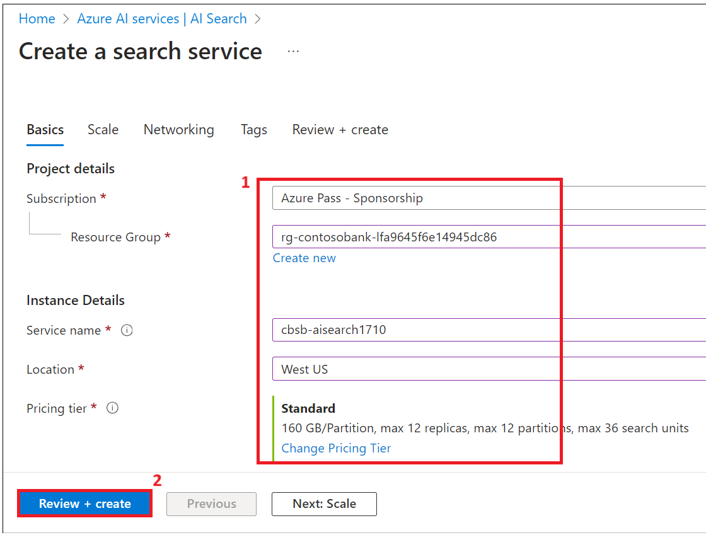

4.  Click on **Create** now.

> 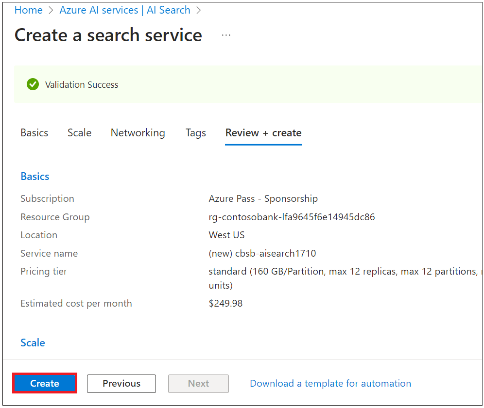

5.  Wait for the deployment and then click on **Go to resource**.

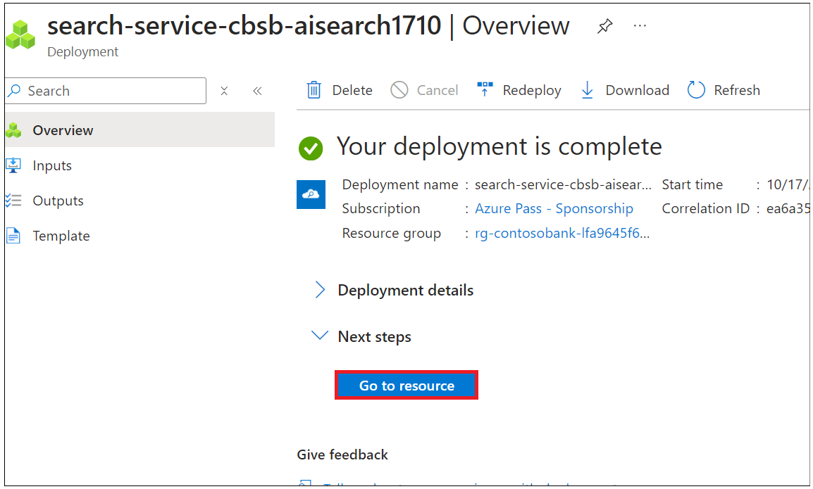

6.  Open a Notepad and make a note of URI value as
    **AZURE_SEARCH_ENDPOINT** ,we use it to communicate to the service.

7.  Navigate to the **Keys** section and grab the API Key and save it as
    AZURE_SEARCH_KEY in your notepad. You will need this to communicate
    with the service.

> 

### Task 8 : Create Azure AI multi-service resource 

1.  Create an Azure AI multi-service resource in the **same region as
    your search service region.**

2.  Open a new tab in a browser and go to `https://portal.azure.com/#create/Microsoft.CognitiveServicesAllInOne`.  Sign in with your Azure subscription account/

3.  Enter below values and then click on **Review + create**.

    - Subscription : Your Azure subscription
    - Resource group : Your existing resource group
    - Region : **Same region as your Search service region**
    - Name : `**`cbsb-aimultiserviceXXXX` (XXXX can be unique number)**
    - Price tier : Standard S0
    - Select **By checking this box I acknowledge that I have read and understood all the terms below** check box.

4.  Review the details and click on **Create**.

5.  Wait for the deployment to be completed. Deployment takes 1-2 min.
    Click on **Go to resource** button.

6.  Click on **Keys and Endpoint** under **Resource management**. Make a
    note of Key and endpoint to use them in next tasks.

### Task 9 : Create Azure OpenAI resource

1.  Open a new tab and search for `Azure OpenAI` service and select
    it.

2.  Click on **Create**.

3.  Enter below details and click on

    - Subscription : Azure subscription
    - Resource group – your Azure resource group
    - Region : **West US/East US**
    - Name – `cbazopenaiXXXX` (XXXX can be unique number)
    - Price tier -**Standard**

4.  Click on **Next- \> Next- \> Create.**

5.  Once the deployment completes, click on **Go to resource**

6.  Expand Resource management from left navigation ,click on Keys and
    Endpoint.Copy endpoint value and assign to AZURE_OPENAI_ENDPOINT ,
    Copy key and assign to AZURE_OPENAI_KEY.Save both these variables in
    your Notepad

> 

7.  Click on **Overview**, right click on **Go to Azure OpenAI Studio**
    and select **Open link in new tab**.

8.  Azure OpenAI opens in new tab. Sign in if required. Close pop -ups

> 

9.  Click on **Deployment** from left navigation menu, select **Deploy
    model -\> Deploy base model.**

10. Search for `gpt-35-turbo-16k` and select it and then click on
    **Confirm**

11. Click on **Customize** button

12. Select available region(same region as your Azure OpenAI region) and
    set Tokens per Minute Rate limit to max and then click on
    **Deploy**.

13. Repeat above steps and deploy- `text-embedding-ada-002`

14. Set maximum **Tokens per Minute Rate Limit** and then click on
    **Deploy.**

> 

### Task 10 : Add a data source to Azure AI search service

1.  Switch back to **Azure portal -> Resource group- \> Azure AI search
    service.**

2.  Click on **Search management -\> Data source** . Select **Add data
    source -\> Add data source.**

3.  Select below values and then click on **Create.**

    - Data source : Azure blob Storage
    - Name : unique name (eg : `enrichdatasource`)
    - Subscription : your Azure subscription
    - Storage account- your Azure storage account
    - Blob container – azureml-blob-XXXX (your default blob container where raw data is uploaded.)

### Task 11 : Create skillsets in Azure AI search

1.  On Overview page, click on **Import data** tab.

2.  Select **Existing data source** and select **enrichdatasourc**, then
    click **Next: Add cognitive skill (Optional)**

> 

3.  Expand **Attach AI Services** and select the AI multi service
    created in previous task.

4.  Expand **Add enrichments** ,keep default skillset name. Enable OCR
    and select all Extract personally identifiable information **except
    Extract personally identifiable information** then click on **Next:
    Customize target index.**

> 

5.  Enter Index name as - `customer-index` , click on **Add filed**.

> 

6.  Enter **Field name** as : `customer_id`, select type="Edm.String"
    and select all skills

7.  Add below fields and then click **Next : Create an indexer**

[TABLE]

> 

8.  Enter the indexer name : `customer-azureblob-indexer` and click
    **submit**.

6.  Click on **Indexer** under **Search management**, you should see new
    indexer with documents

7.  Click on **Indexes -\> customer-index.** Wait for the Vetor index
    size to update**.**

8.  Search with High value customers, you should search results.

### Task 12 : Build and Deploy Chat app in Azure AI Studio.

1.  Open a new tab and go to `https://ai.azure.com` and sign in with
    your Azure subscription account.

2.  Click on **New project.**

3.  Enter the unique project name(`cbsbaoai-proj`) and then click on
    Create a new hub link on the Hub drop down link as shown in below
    image.

4.  Enter below values and then click on **Next**

    - Hub name : `cbcbaoaihub`

    - Subscription : Your Azure subscription

    - Resource group – your existing resource group

    - Region -same region as your Azure Open AI region

    - Connect Azure AI Services or Azure OpenAI : Select your Azure OpenAI service

    - Connect Azure AI Search : Select your Azure AI Search

5.  Review the details and then click on **Create a project** button.

6.  From left navigation menu, click on **Chat** under **Playground**
    .In Setup ,select **Add your data** and then click on **Add a new
    data source**.

7.  Select **Azure AI Search** as **Data source** and then click
    **Next**.

8.  Select your **Azure AI Search** service and the Index your
    **customer-index**,then click Next.

> 

9.  Keep the default values, click Next.

10. Click on **Create** now.

11. Enter below prompt in Type here query text bod and press send
    button.

`Details of Customer ID- 3  

> 

12. Enter below prompt and press send

`List high value customers`

![]](./media/image145.png)

13. Now, you are ready to deploy your app. Click on **Deploy- > as a
    web app.**

> 

14. Enter below details and then click on **Deploy**. Deployment takes
    5-10 min to complete.

    - Select **Create a new web app** radio button

    - Name : should be unique name (eg `mlappchatappXXXX` – XXXX can be uniquenumber)
    - Subscription : Your Azure subscription
    - Resource group – your resource existing resource group
    - Location – West US / East US/East US 2 ( usually east us has high demand and deployment may fail). You can use the same location as the hub

    - Pricing plan : Standard (S1) /S2

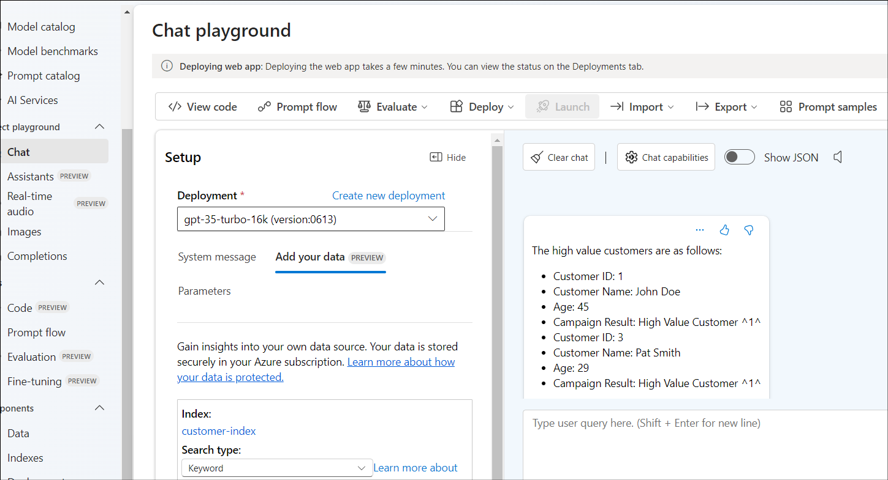

### Task 13 : Access and Explore the Chatapp.

1.  Go back Azure Portal Home page. Search for **App Services** and
    select it from drop down as shown in the below image.

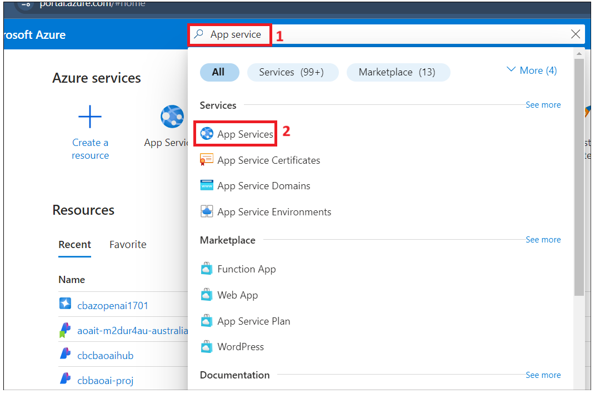

2.  Click on App name.

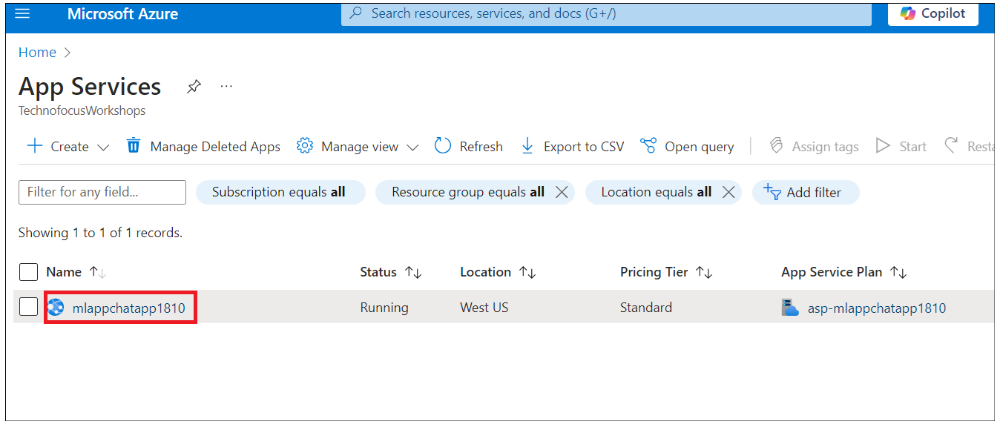

3.  Expand **Settings** and select **Environmental variables**. Search
    for **Azure AI Search** and make sure all the variable are updated
    correctly. Click on **Azure_SEARCH_KEY.**

> 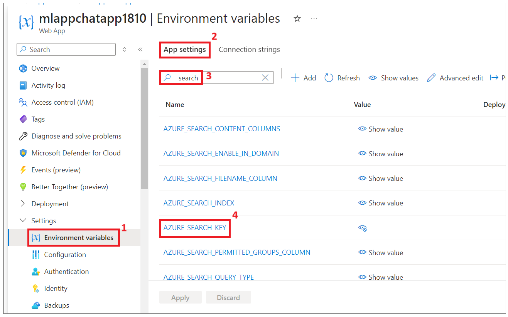

4.  Get the key from your Setup Azure AI Search service task ( REsoruce
    group- > Azure AI search service- > Settings- > Keys -> Key 1),
    enter the key in Value field and then click on Apply.

5.  Click on **Add** now to add AML model endpoint value.

6.  Go back to AML Studio tab -> Assets -> Endpoints ->
    finance-service. Copy the REST endpoint value.

7.  Switch back App service tab, Enter below values and then click on
    **Apply**.

    - Name : `AML_ENDPOINT`

    - Value : Your AML REST endpoint value.

8.  Click on **Apply** and **confirm** changes.

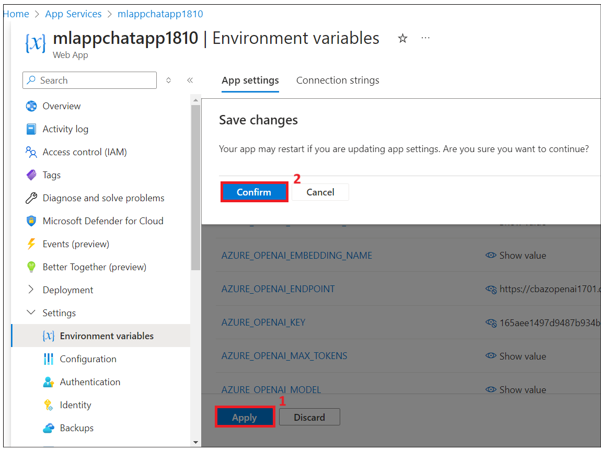

9.  Select **API->CORS** and select

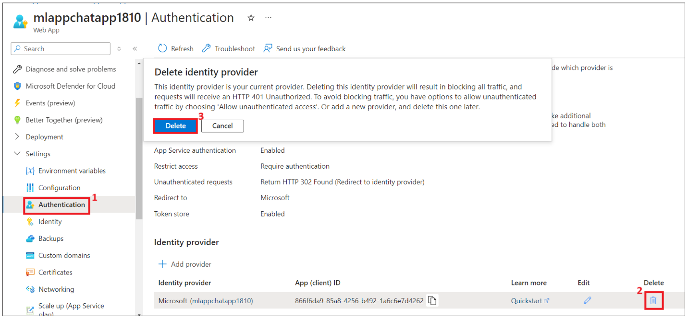

10. From the collapsible left menu under **Settings**,
    select **Authentication**. **Delete** the existing Identity provider
    and confirm deletion.

11. Click on **Add identity provider**.

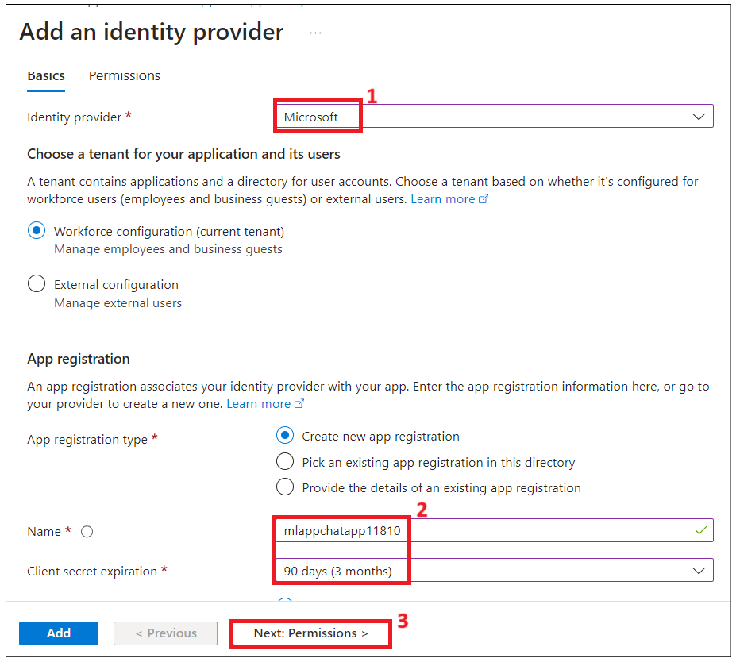

12. Select Microsoft as Identity provider, update Name and select Client
    secret expiration -90 days and then click **Next:Permissions**.

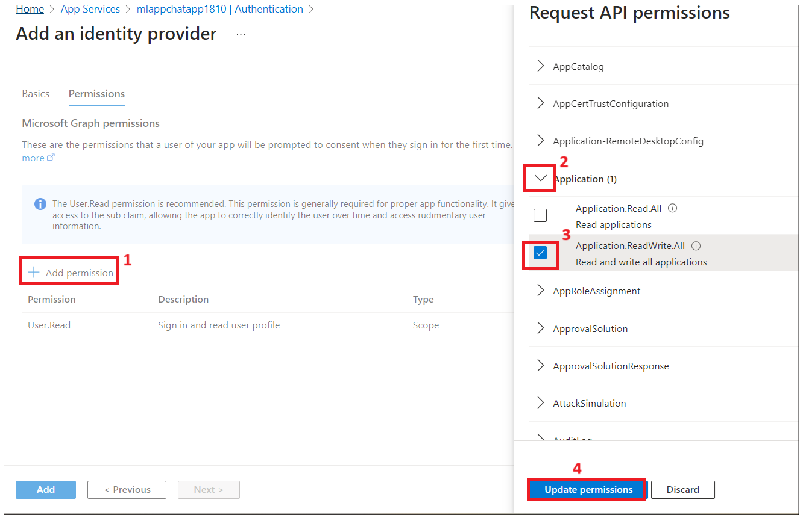

13. Click on Add permission. Select **Application** ->
    Application.ReadWrite.All and then click on **Update permission.**

14. Click on **Add** now.

> 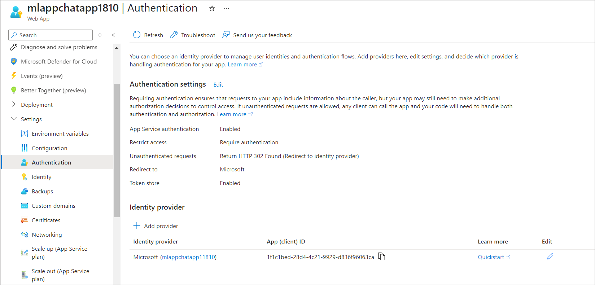

9.  Click on **Overview** and click on **Restart**. Confirm restart by
    clicking on **Yes**.

10. Click on **Overview** and then click **on Default domain**.

> 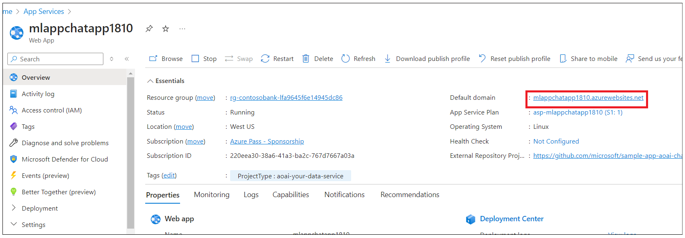

11. App opens in new tab, Click on **Accept** to allow permissions.

12. App opens,enter below prompts and explore it.

`List high value customers`

`give customer details who spend >30 year

`give customer details who mortgage is not 0`

